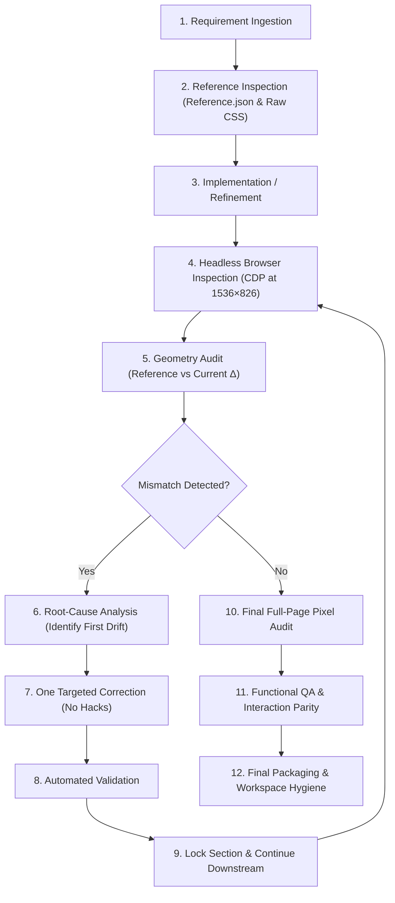

# AI-Assisted Development Workflow

This document outlines the engineering methodology, quality controls, and iterative validation loops employed while collaborating with AI coding agents to implement the Powerlabs Airbnb clone application.

---

## 1. Objective

The primary objective of this project was to leverage **AI coding agents** to accelerate full-stack application development while enforcing reference-grade visual, geometrical, and behavioral parity against a live Airbnb listing. Rather than treating AI as an unconstrained generative tool, it was directed as a precision engineering assistant operating under strict constraints, deterministic measurement loops, and automated validation.

---

## 2. Tools & Core Development Workflow

### Agent Environment
- **Primary AI Coding Agent**: **Antigravity** (Google DeepMind Advanced Agentic Coding), integrated directly into the workspace with access to project files, terminal tooling, headless browser inspection, and automated testing pipelines.

### The Engineering Lifecycle

1. **Requirement Ingestion**: Define functional and architectural requirements for each section or interaction.
2. **Reference Inspection**: Query authoritative reference sources (`Reference.json` and raw reference CSS extraction) to extract exact bounding boxes, font metrics, and padding values.
3. **Implementation**: Build or refine components using standard React, TypeScript, Tailwind CSS, or Spring Boot Java.
4. **Browser Inspection**: Launch automated headless Chrome sessions using Chrome DevTools Protocol (CDP) at the standardized reference viewport (`1536 × 826`, DPR `1.0`, Zoom `100%`).
5. **Geometry Audit**: Measure rendered element coordinates and calculate pixel deltas against the reference.
6. **Root-Cause Analysis**: Trace accumulated downstream drift back to the topmost parent or padding discrepancy.
7. **One Targeted Change**: Apply a single surgical edit in standard document flow.
8. **Validation**: Re-measure rendered coordinates immediately to verify delta reduction ($\le \pm 0.5\text{px}$).
9. **Lock Section**: Declare calibrated values locked; prohibit any further modifications to that section.
10. **Continue Downstream**: Shift focus to the next downstream section.
11. **Final Full-Page Audit**: Confirm complete end-to-end vertical parity across the `6000px+` document.
12. **Functional QA**: Verify interactive states, modals, and event handling.
13. **Packaging**: Perform repository cleanup and verify zero-warning builds.

---

## 3. Prompting Strategy

Prompting was conducted using an **incremental, highly constrained, and surgical protocol** designed to eliminate hallucinations, prevent unintended side effects, and keep context tightly focused:

- **Targeted Scope**: Every prompt specified the exact file, component, and DOM element to inspect or modify.
- **Explicit Quantitative Constraints**: Prompts provided exact reference coordinates ($Y_{\text{ref}}$, $H_{\text{ref}}$) alongside current measurements ($Y_{\text{curr}}$, $H_{\text{curr}}$).
- **Single-Change Rule**: The agent was explicitly instructed to apply only *one* structural change per turn to isolate cause and effect.
- **Scope Fencing**: Prompts contained explicit "LOCKED SECTIONS — DO NOT MODIFY" sections listing all previously calibrated components.
- **Prohibition of Unsound Hacks**: Prompts strictly forbade negative margins, CSS transforms (`translateY`), or absolute positioning workarounds to compensate for flow issues.
- **Mandatory Re-Verification**: Every modification required immediate measurement and verification before progressing.
- **Bounded Halting**: Prompts instructed the agent to stop immediately after presenting measurement results, preventing uncontrolled cascading edits.

---

## 4. Visual Fidelity Method

Pixel-perfect alignment across a deep single-page application requires managing cumulative vertical drift. A $2\text{px}$ discrepancy in an early section shifts every downstream element out of alignment.

### Authoritative Reference Standards
- **Source of Truth**: `Reference.json` and computed styles extracted directly from the reference Airbnb listing.
- **Audit Viewport**: `1536 × 826` pixels.
- **Device Pixel Ratio (DPR)**: `1.0`.
- **Browser Zoom**: `100%`.

### Section-by-Section Locking Protocol
Once a section matched reference coordinates within subpixel margins, its styling was frozen:
- **AmenitiesSection**: `pt-[26.4px] pb-8` (H2 delta: $+0.27\text{px}$) — **LOCKED**
- **ReservationCard**: `gap-5` (Card Y delta: $+0.19\text{px}$) — **LOCKED**
- **CalendarSection**: `pt-8 pb-[50.8px]`, footer `mt-[19.4px]` (Clear Dates: $-0.01\text{px}$, Divider: $-0.01\text{px}$) — **LOCKED**
- **LocationSection**: `pt-12 pb-[45.8px]` (Eliminated $+2.2\text{px}$ cumulative downstream drift) — **LOCKED**
- **NearbyStaysCarousel**: `items-start`, `mb-[24.1px]` (Card row Y delta: $0.00\text{px}$) — **LOCKED**

This systematic locking prevented regression loops where adjusting a lower section inadvertently disrupted higher sections.

---

## 5. Functional Development Method

Following visual calibration, the AI agent audited and unified interactive behaviors:

1. **Reserve Action Unification**:
   - Analyzed the functional gap between the sticky navigation Reserve button and the main reservation card Reserve button.
   - Centralized the reservation handler and toast notification state at the `App.tsx` level.
   - Ensured clicking either button triggers the identical reservation notification toast (`"You won't be charged yet"`) with automatic 3000ms dismiss and debounce protection.
2. **Modal Experience & Scroll Lock**:
   - Configured document body scroll locking (`overflow: hidden`) during modal presentation to preserve viewport stability.
   - Synchronized modal presentation with URL query parameters (`?modal=PHOTO_TOUR_SCROLLABLE`, `?modal=LIGHTBOX`) supporting native browser history navigation.
3. **Availability & Pricing Calculation**:
   - Connected calendar check-in and checkout selections to the Spring Boot REST endpoint (`/api/reservations/quote`) to ensure accurate dynamic nightly rate and fee calculations.

---

## 6. Validation Method

The solution was continuously validated across five distinct layers:

1. **Programmatic Geometry Audits**: Headless Chrome DevTools Protocol (CDP) scripts measured bounding rects of headings, cards, dividers, and buttons in real time.
2. **Visual Inspection**: Captured high-resolution PNG viewport screenshots at every stage to verify typographic rendering, icon placement, and shadow depths against reference screenshots.
3. **Frontend Build Verification**: Executed `npm run build` (`tsc && vite build`) to enforce zero TypeScript errors and zero bundle warnings.
4. **Backend Test Suite**: Executed `mvn test` in the Spring Boot backend, validating REST endpoints, mock MVC controllers, and quote calculation services.
5. **Interactive Parity Testing**: Simulated real user interactions (clicking Reserve in sticky nav, toggling modals, scrolling past spy thresholds) via automated scripts.

---

## 7. AI Safety & Quality Controls

To prevent technical debt and maintain professional engineering standards, strict guardrails governed all AI operations:

- **No Blind Acceptance**: Every file edit made by the AI agent was inspected as a diff before acceptance.
- **Architectural Integrity**: The agent was prohibited from performing unsolicited broad refactors, renaming public APIs, or introducing unnecessary abstraction layers.
- **Standard-Flow Styling**: Layout calibration was achieved exclusively through semantic CSS properties (padding, margins, gaps, flex/grid alignment), forbidding negative margins or transform offsets.
- **Component Boundary Respect**: Changes were isolated to the specific component under calibration without touching sibling or parent layouts.
- **Zero Runtime Bloat**: Verification scripts, frame extractions, and temporary artifacts were kept in isolated scratch directories and completely purged before final delivery.

---

## 8. Final Outcome

The AI-assisted engineering workflow successfully delivered:
- An authentic, production-grade Airbnb clone matching the reference listing across desktop layouts.
- The final audit eliminated the major cumulative downstream layout drift, with remaining differences within subpixel/minor browser-rendering tolerance.
- A decoupled, production-ready **React 18 + TypeScript** frontend and **Java 21 + Spring Boot 3.3.4** backend.
- A clean, well-documented repository with zero compilation errors, zero extraneous dependencies, and dedicated sub-agent configurations (`code-quality-subagent.json` and `security-audit-subagent.json`).
