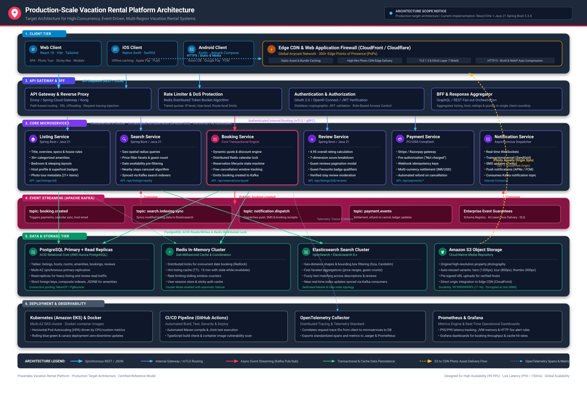

# Production-Scale Vacation Rental Platform Architecture

## 1. Purpose & Scope

This document defines the **target production-scale architecture** for a high-concurrency, globally distributed vacation rental platform (e.g., Airbnb). It establishes the architectural blueprint required to scale the platform to millions of active listings, concurrent search queries, and high-frequency booking transactions with sub-second latency and five-nines availability (99.999%).

> **IMPORTANT ARCHITECTURAL NOTE**  
> This architecture represents a **production-scale target architecture**. The current project implementation is a **React/Vite frontend with a Java 21 + Spring Boot 3.3.4 backend** and does not implement every production infrastructure component shown here. Production components such as distributed Kubernetes clusters, Kafka event brokers, PostgreSQL clusters, Redis caches, Elasticsearch indexes, AWS S3 storage, and third-party payment gateways represent the operational target architecture designed for horizontal scale.

---

## 2. Architecture Diagram

The high-resolution architectural diagram illustrates the complete end-to-end topology across all tiers:



*(High-resolution vector diagram available at [`architecture_diagram.svg`](architecture_diagram.svg); rasterized rendering available at [`architecture_diagram.png`](architecture_diagram.png)).*

---

## 3. Current Implementation vs. Production Target Architecture

The table below contrasts the current delivered assignment against the target production-scale architecture:

| Component / Layer | Current Assignment Implementation | Target Production-Scale Architecture | Classification |
| :--- | :--- | :--- | :--- |
| **Frontend Framework** | React 18, TypeScript, Tailwind CSS, Vite | React 18 SPA + Next.js SSR / React Server Components | **Implemented** (SPA) |
| **Mobile Clients** | Responsive mobile browser viewport | Native iOS (Swift/SwiftUI) + Android (Kotlin/Compose) | **Target** (Proposed) |
| **Styling & Icons** | Tailwind CSS 3.4, Lucide React, Cereal font | Design System (AirPalette/Cereal), CDN-hosted font assets | **Implemented** |
| **Backend Runtime** | Java 21, Spring Boot 3.3.4 (Single Service) | Polyglot Microservices (Java 21 / Spring Boot, Go, Node.js) | **Implemented** (Monolith Core) |
| **API Protocol** | REST over HTTP/JSON (`/api/*`), CORS configured | REST, GraphQL (BFF), internal gRPC over HTTP/2 with mTLS | **Implemented** (REST) |
| **API Gateway / BFF** | Direct client-to-backend connection via Vite proxy | Envoy / Spring Cloud Gateway / Kong with GraphQL BFF | **Target** (Proposed) |
| **Authentication & AuthZ** | Mock user session, client-side saved state | OAuth 2.0 / OpenID Connect, stateless JWTs, Okta/Keycloak | **Target** (Proposed) |
| **Primary Database** | In-memory seeded service models | AWS Aurora PostgreSQL (Multi-AZ, Read Replicas, PgBouncer) | **Target** (Proposed) |
| **Caching Layer** | Client-side React state, in-memory Maps | Redis In-Memory Cluster (Redlock distributed locks, L2 cache) | **Target** (Proposed) |
| **Search Engine** | In-memory geospatial array filter (`Candolim`) | Elasticsearch 8.x / OpenSearch Cluster (geo-shapes, facets) | **Target** (Proposed) |
| **Media / Photo Storage** | Static assets served from `frontend/public/images/` | Amazon S3 + CloudFront Edge CDN with WebP/AVIF auto-tuning | **Target** (Proposed) |
| **Event Streaming** | Synchronous service-to-service calls | Apache Kafka Cluster (`booking.created`, `search.index.sync`) | **Target** (Proposed) |
| **Payment Processing** | UI notification simulation ("You won't be charged yet") | Stripe / Razorpay API integration with PCI-DSS tokenization | **Target** (Proposed) |
| **Notifications** | Client-side floating toast notification | Notification Microservice (WebSockets, SendGrid, Twilio, APNs) | **Target** (Proposed) |
| **Containerization** | Local Node.js + Maven JVM runtime execution | Docker Container Images (Distroless base images) | **Target** (Proposed) |
| **Container Orchestration**| Manual terminal process management | Amazon EKS (Kubernetes) with Horizontal Pod Autoscaler (HPA)| **Target** (Proposed) |
| **CI/CD Automation** | Local scripts (`npm run build`, `mvn test`) | GitHub Actions CI/CD pipelines + ArgoCD GitOps deployment | **Target** (Proposed) |
| **Observability** | Standard console logging (`System.out`, Spring logger)| OpenTelemetry Collector, Prometheus metrics, Grafana dashboards| **Target** (Proposed) |

---

## 4. Architectural Layers

### 1. Client Tier
- **Web Client (React 18 / Vite / Tailwind)**: Delivers a responsive single-page application (SPA) featuring photo tour overlays, full-screen lightbox, interactive two-month availability calendar, and a scroll-spy sticky navigation bar.
- **Mobile Clients (iOS & Android)**: Native applications built in Swift (iOS) and Kotlin (Android) communicating with dedicated Backend-for-Frontend (BFF) endpoints.
- **Edge CDN (CloudFront / Cloudflare)**: Global Anycast CDN spanning 300+ Edge Points of Presence (PoPs) terminating SSL/TLS 1.3, mitigating DDoS attacks (L3/L4/L7), and caching static JS/CSS bundles and photographic assets.

### 2. API Gateway & BFF Tier
- **Reverse Proxy & Routing**: Central ingress (Envoy or Spring Cloud Gateway) handling TLS offloading, path-based routing, and request correlation IDs.
- **Rate Limiting & Throttling**: Protects downstream microservices using Redis-backed token bucket rate limiters scoped by client IP, authenticated user ID, and API endpoint.
- **Authentication & Authorization**: Validates incoming asymmetric cryptographic JSON Web Tokens (JWT) issued by an OAuth 2.0 / OpenID Connect identity provider.
- **Backend-For-Frontend (BFF)**: Consolidates fan-out calls across multiple domain services (listing metadata, host profile, pricing quotes, reviews) into a single optimized payload for the web and mobile clients.

### 3. Core Microservices Tier
- **Listing Service**: Manages property specifications, bedroom configurations, 36+ categorized amenities, host relationships, and photo tour metadata.
- **Search Service**: Executes high-throughput geospatial radius queries, date-range availability filters, price facet aggregations, and recommendations (such as the "Nearby Stays" carousel).
- **Booking & Reservation Service**: Serves dynamic quote calculations, manages reservation state machines, tracks cancellation refund eligibility, and enforces date-blocking consistency.
- **Review & Rating Service**: Calculates overall scores (e.g., 4.95), maintains 7-dimension categorical ratings (Cleanliness, Accuracy, Check-in, etc.), and moderates verified guest reviews.
- **Payment Service**: Connects to payment gateways (Stripe, Razorpay) handling pre-authorizations, customer escrow, multi-currency conversion (INR/USD), and automated cancellation refunds.
- **Notification Service**: Asynchronously dispatches reservation confirmation emails, SMS check-in reminders, mobile push alerts (APNs/FCM), and live WebSocket messages.

### 4. Event Streaming Tier (Apache Kafka)
- Acts as the central asynchronous nervous system of the platform, decoupling transactional writes from downstream operational consumers.
- **Key Topics**:
  - `booking.created`: Emitted when a reservation is placed; consumed by Payment Service, Notification Service, and Host Calendar Sync.
  - `booking.cancelled`: Emitted upon user cancellation; triggers refund processing, inventory unblocking, and email dispatch.
  - `listing.updated`: Emitted on host listing updates; triggers near-real-time synchronization to Elasticsearch indexes.
  - `notification.dispatch`: Consumed by the Notification Service for asynchronous delivery.

### 5. Data & Storage Tier
- **PostgreSQL (AWS Aurora)**: Primary ACID-compliant relational database. Configured with a Multi-AZ write primary and auto-scaling read replicas fronted by connection pooling (PgBouncer/HikariCP).
- **Redis Cluster**: Distributed in-memory cache providing sub-millisecond access for hot listing records, session management, and distributed lock coordination (Redlock) to prevent double-booking.
- **Elasticsearch / OpenSearch**: Distributed search cluster optimized for geospatial bounding-box queries, full-text descriptions, and facet aggregations.
- **Amazon S3**: Object storage delivering $99.999999999\%$ (11 9s) durability for original high-resolution listing photography, generating responsive thumbnail variants served through the Edge CDN.

### 6. Deployment & Observability Tier
- **Kubernetes (Amazon EKS) & Docker**: Microservices packaged into lightweight, secure container images running on multi-AZ Kubernetes worker nodes with Horizontal Pod Autoscaling (HPA).
- **CI/CD (GitHub Actions)**: Automated deployment pipeline running unit tests, integration tests, container vulnerability scans, and canary deployments.
- **OpenTelemetry (OTel)**: Standards-based instrumentation tracing distributed requests across API gateways, microservices, and database queries via unified Trace IDs.
- **Prometheus & Grafana**: Centralized metric scraping, alerting (P95 latency thresholds, HTTP 5xx spikes), and operational dashboards.

---

## 5. End-to-End System Flows

### Flow 1: High-Performance Listing Details Request
```
[User Browser]
       │
       ▼ (1) GET /api/listings/mirashya-ug10 (HTTPS)
 [Edge CDN] ──── (Cache Hit: Static Assets & WebP Images) ───► [Browser Render]
       │ (Cache Miss: API Request)
       ▼
 [API Gateway / BFF]
       │ (Validate JWT & Rate Limit via Redis)
       ▼
 [Listing Service]
       ├── (2) Check Redis L2 Cache ───► [Cache Hit: Return in < 2ms]
       │          │ (Cache Miss)
       │          ▼
       └── (3) Query PostgreSQL Read Replica ───► [Update Redis]
                  │
                  ▼
         [Return Aggregated DTO to Client]
```

### Flow 2: Distributed Booking Transaction & Event Flow
```
[User clicks "Reserve"]
       │
       ▼ (1) POST /api/reservations/book
 [API Gateway / BFF]
       │
       ▼
 [Booking Service]
       │
       ├── (2) Acquire Redis Redlock for dates [10/18/2026 - 10/23/2026]
       │          │ (Lock Failed: Return "Dates No Longer Available")
       │          ▼ (Lock Acquired)
       ├── (3) Begin ACID Transaction in PostgreSQL Primary
       │          ├── Insert Reservation record (status: PENDING)
       │          └── Mark calendar dates unavailable
       │
       ├── (4) Commit DB Transaction & Release Redis Lock
       │
       └── (5) Publish Event to Kafka: "topic: booking.created"
                     │
         ┌───────────┼───────────┐
         ▼           ▼           ▼
  [Payment Service] [Search Sync] [Notification Service]
   (Pre-authorize)   (Update ES)  (Send Email & Push)
```

### Flow 3: Photo Storage & Edge Delivery Flow
```
[Host Uploads Photo]
       │
       ▼ (1) Request Upload URL
 [Listing Service] ───► Returns S3 Pre-Signed URL
       │
       ▼ (2) Direct Upload via HTTPS PUT
 [Amazon S3 Bucket]
       │
       ▼ (3) S3 Event Triggers Lambda Image Processor
 [AWS Lambda] ───► Generates WebP/AVIF variants (Hero 1200px, Tour 800px, Thumb 400px)
       │
       ▼ (4) Saved back to S3 Storage
 [S3 Media Bucket]
       │
       ▼ (5) Edge CDN Pull (CloudFront)
 [Edge CDN PoP] ───► Cached globally at edge; served to clients with < 20ms TTFB
```

---

## 6. Scaling, Reliability & Security Considerations

### Scaling Strategies
- **Stateless Application Tier**: Microservices maintain zero in-memory user state; all state resides in Redis or PostgreSQL, enabling instantaneous auto-scaling from 10 to 1,000+ pods via Kubernetes HPA.
- **Database Read Scaling**: Over 90% of vacation rental platform traffic is read-heavy. Aurora PostgreSQL read replicas offload all listing detail and review retrieval from the primary write database.
- **Geospatial Search Sharding**: Elasticsearch indices partitioned by geographical regions (e.g., `india-goa`, `europe-mediterranean`) to localize search execution.

### Reliability & Fault Tolerance
- **Distributed Concurrency Control**: Double-booking prevented across concurrent requests using Redis Redlock distributed locks combined with PostgreSQL unique constraints (`listing_id`, `check_in_date`).
- **Circuit Breaking & Fallbacks**: Downstream communication protected by Resilience4j circuit breakers; if the Review Service experiences latency, the BFF returns listing details with cached review aggregates.
- **Dead-Letter Queues (DLQ)**: Failed Kafka consumer events (e.g., notification gateway timeouts) route to a DLQ for automated retry with exponential backoff.

### Security Architecture
- **Stateless Zero-Trust Networking**: All service-to-service communication inside the Kubernetes cluster enforced via mutual TLS (mTLS) with Istio service mesh.
- **Strict Input Validation**: All incoming payloads validated via Jakarta Validation (`@Valid`, `@NotNull`, `@Min`, `@Max`) at the API Gateway and service boundaries.
- **Financial Compliance**: Credit card data never touches application servers; tokenized pre-authorizations are conducted directly via PCI-DSS Level 1 compliant gateway SDKs.
